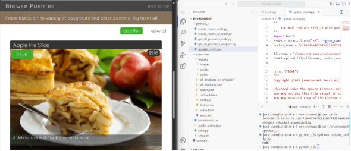
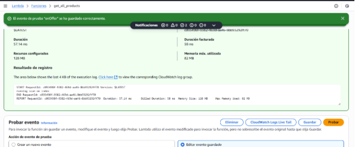
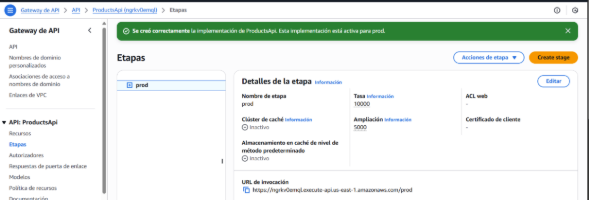
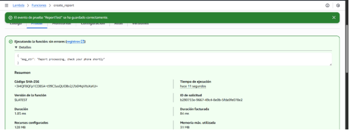
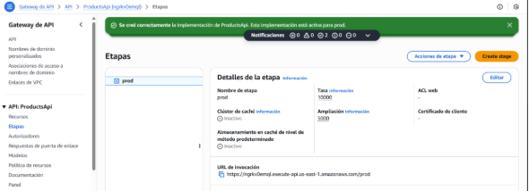
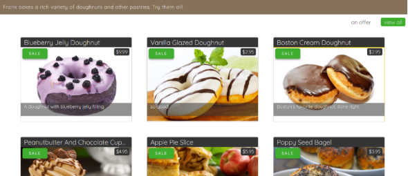

Lab 7.1: Creating Lambda Functions Using the AWS SDK for Python

Este informe detalla los pasos para configurar un entorno de desarrollo en AWS Cloud9, crear y probar funciones Lambda, integrarlas con una API REST en API Gateway, y actualizar un sitio web para reflejar cambios en DynamoDB. Se incluyen capturas de pantalla correspondientes a cada tarea para ilustrar los pasos clave. 

### **Tarea 1: Configuración del Entorno de Desarrollo**
En esta tarea, se configuró el entorno de desarrollo integrado de Visual Studio Code (IDE de VS Code) para crear funciones Lambda.

**Conexión al IDE de VS Code**

1. Se seleccionó *Details (Detalles) > AWS: Show (AWS: mostrar)* en la parte superior de las instrucciones.
1. Se copiaron las credenciales *LabIDEURL* y *LabIDEPassword*.
1. Se abrió *LabIDEURL* en una nueva pestaña del navegador y se ingresó *LabIDEPassword* en la ventana *Welcome to code-server*.

**Descargar y Extraer Archivos**\
Se ejecutaron los siguientes comandos en el terminal de VS Code:

- wget https://aws-tc-largeobjects.s3.us-west-2.amazonaws.com/CUR-TF-200-ACCDEV-2-91558/05-lab-lambda/code.zip -P /home/ec2-user/environment
- unzip code.zip

**Ejecutar el Script de Configuración**\
Se dio permiso de ejecución y se ejecutó el script con:

- chmod +x ./resources/setup.sh && ./resources/setup.sh\
  Durante la ejecución, se proporcionó la dirección IPv4 obtenida de *whatismyipaddress.com*.

**Verificar la Instalación del SDK**\
Se comprobó la instalación del SDK de Python con el comando:

- pip3 show boto3\
  Se ignoraron mensajes relacionados con versiones de *pip*.

**Confirmar Recursos Disponibles**

- En Amazon S3, se verificó el bucket existente y se comprobó que el sitio web cargara correctamente desde el archivo *index.html*.
- En DynamoDB, se inspeccionó la tabla *FoodProducts* y el índice *special\_GSI*.
- En API Gateway, se verificó la existencia de los métodos GET y POST de los recursos */products*, */products/on\_offer* y */create\_report*.\
  Se probaron todos los endpoints desde la consola, obteniendo código de estado 200 en cada uno.

**Actualizar el Archivo config.js**\
Se abrió el archivo *resources/website/config.js* y se reemplazó el valor *null* por la URL de invocación del API Gateway, asegurando el formato correcto.

**Actualizar el Archivo de Configuración en S3**\
Se reemplazó el nombre del bucket en *python\_3/update\_config.py* y se ejecutó el script con:

- cd ~/environment/python\_3
- python3 update\_config.py

**Verificar el Sitio Web**\
Finalmente, se cargó nuevamente el archivo *index.html* desde el bucket S3 para comprobar que el sitio web mostrara correctamente los elementos del menú.

### **Tarea 2: Creación de una Función Lambda para Recuperar Datos de DynamoDB**
En esta tarea, se creó una función Lambda capaz de obtener información desde DynamoDB.

**Editar el Código de la Función Lambda**\
Se abrió el archivo *python\_3/get\_all\_products\_code.py* y se reemplazaron los marcadores *<FMI\_1>* y *<FMI\_2>* con los valores correctos de la tabla e índice de DynamoDB.

**Prueba Local del Código**\
Se ejecutó el archivo con *python3 get\_all\_products\_code.py* y se obtuvo como resultado la información de la tabla en formato JSON.

**Modificación Temporal para Pruebas**\
Se modificó temporalmente la condición *if offer\_path\_str is None:* para observar la diferencia en los datos obtenidos. Luego, se revirtió el cambio.

**Empaquetar y Subir el Código**\
El archivo se comprimió y subió al bucket S3 con los siguientes comandos:

- zip get\_all\_products\_code.zip get\_all\_products\_code.py
- aws s3 cp get\_all\_products\_code.zip s3://<bucket-name>

**Creación de la Función Lambda**\
Finalmente, se ejecutó *python3 get\_all\_products\_wrapper.py* para crear la función Lambda, la cual se probó correctamente en la consola de AWS.

### **Tarea 3: Configuración de la API REST para Invocar la Función Lambda**
En esta tarea se configuró la API Gateway para conectar los endpoints existentes con la nueva función Lambda.

**Prueba de la API Existente**\
Se probó el método *GET /products* para confirmar que devolviera datos simulados antes de integrar Lambda.

**Integración con Lambda**\
Se reemplazó la integración simulada con la función Lambda creada previamente y se habilitó el encabezado *Access-Control-Allow-Origin* para permitir solicitudes CORS.

**Configuración del Recurso /on\_offer**\
Se configuró el método *GET /on\_offer* para invocar la misma función Lambda y se añadió una plantilla de mapeo JSON que envía el valor del contexto *resourcePath*.

**Despliegue de la API**\
Finalmente, se desplegó la API seleccionando la raíz del recurso y la etapa *prod*.

### **Tarea 4: Creación de una Función Lambda para Solicitudes de Reportes**
En esta etapa se implementó una segunda función Lambda, responsable de procesar solicitudes POST desde el sitio web.

**Probar el Código Localmente**\
Se ejecutó el archivo *python\_3/create\_report\_code.py* para validar su funcionamiento y se comentó la última línea del código para evitar llamadas automáticas durante la creación de la función Lambda.

**Preparar y Subir el Código**\
Se reemplazó el valor *<FMI\_1>* por el ARN del rol *LambdaAccessToDynamoDB* en *create\_report\_wrapper.py*.\
Luego, se empaquetó y subió el archivo con:

- zip create\_report\_code.zip create\_report\_code.py
- aws s3 cp create\_report\_code.zip s3://<bucket-name>

**Creación de la Función Lambda**\
Se ejecutó *python3 create\_report\_wrapper.py* y se probó la función desde la consola de AWS, creando un evento de prueba llamado *ReportTest*.

### **Tarea 5: Configuración de la API REST para Invocar la Función Lambda de Reportes**
**Configuración del Método POST**\
En API Gateway, se reemplazó la integración simulada por una conexión directa a la función Lambda *create\_report*, seleccionando la región *us-east-1*.

**Despliegue de la API**\
Posteriormente, se desplegó nuevamente la API en la etapa *prod* para aplicar los cambios.
### 

### **Tarea 6: Prueba de la Integración Usando el Sitio Web de la Cafetería**
**Cargar el Sitio Web**\
Se cargó el sitio web de la cafetería desde el bucket S3 utilizando la URL del objeto *index.html*.

**Probar la Funcionalidad Dinámica**\
En la sección *Browse Pastries*, se probó el botón *view all* para verificar que los productos se cargaran correctamente desde DynamoDB.

**Actualizar Datos en DynamoDB**\
Se modificó el valor *price\_in\_cents* de un ítem en la tabla *FoodProducts*, y al recargar el sitio web, se reflejó correctamente el cambio.

### **Conclusión**
Este laboratorio permitió integrar con éxito los servicios de **AWS Lambda, API Gateway, DynamoDB y S3**, logrando un flujo completo entre backend y frontend sin necesidad de servidores.\
El sitio web del café se actualiza en tiempo real a partir de los datos de DynamoDB, demostrando el poder de las arquitecturas *serverless*.\
El uso de scripts en Python y del SDK *boto3* simplificó la automatización de la creación, configuración e integración de los recursos.\
Con esto, se completó una infraestructura funcional, escalable y dinámica basada completamente en los servicios administrados de AWS.

